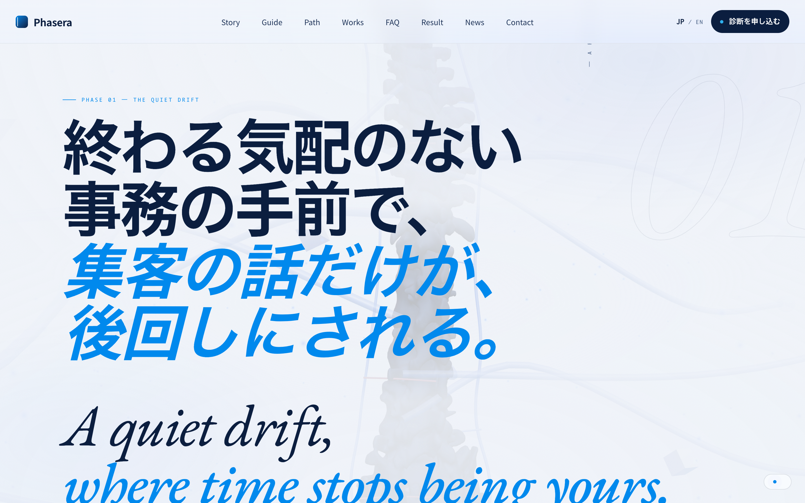
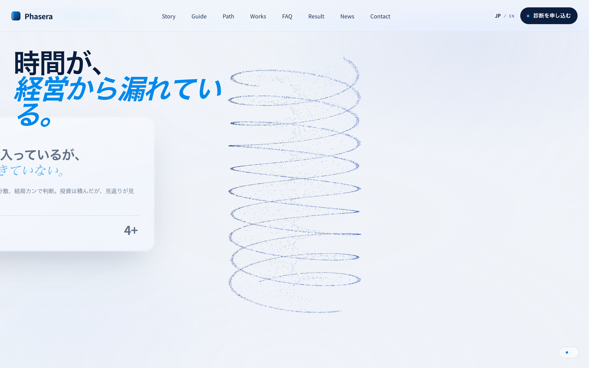

# Phasera

> 3Dアセットを使ったインタラクティブな静的Webサイト。Vercel にデプロイ済み。

[](https://phasera.vercel.app) [](#)

🔗 **ライブデモ: https://phasera.vercel.app**

---

## スクリーンショット

> 🔗 本番: **https://phasera.jp** — スクロールに連動して変形する Three.js の3D背景が特徴の物語型ランディングページ。

| ヒーロー | 3D粒子（スクロール連動） | 螺旋への変形 |
|:---:|:---:|:---:|
|  |  |  |

---

## 概要

軽量な静的サイトとして構築されたインタラクティブWeb体験。`assets/3d` の3Dアセットを用いたビジュアル表現を中心に、ビルド不要で即時配信できる構成（Vercel Edge Cache 利用）。

---

## 構成

```
index.html              # エントリ
assets/3d/              # 3Dアセット
anatomical-garden-handoff/   # デザイン/実装ハンドオフ資料
robots.txt / sitemap.xml     # SEO
vercel.json             # デプロイ設定
```

デプロイ詳細は [`DEPLOYMENT.md`](./DEPLOYMENT.md) を参照。

---

## このプロジェクトで見せられること

- **3D × Web** のビジュアル表現
- 静的配信 + Edge Cache による高速デリバリ
- SEO/配信まで含めた本番デプロイ運用

---

*※ ポートフォリオ目的の公開リポジトリです。*
